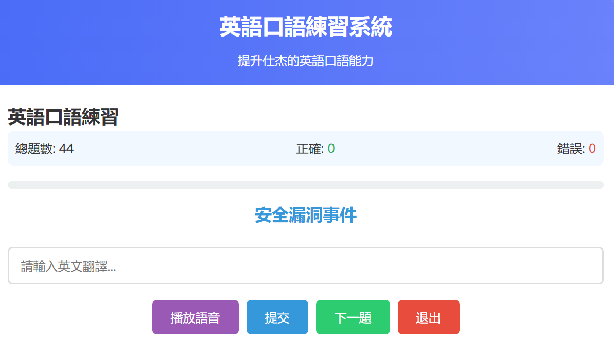
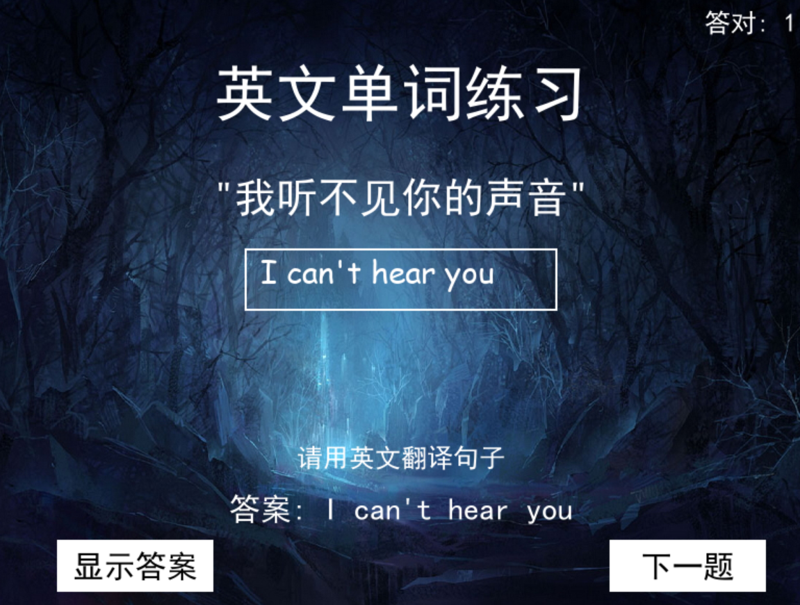

# 🗣️ 英語口語練習系統

一個用來提升 **英語口語與句型熟悉度** 的互動式學習系統，提供 **網頁版、命令列版（CLI）與圖形介面版（GUI）** 三種使用方式，適合自學、考試準備與日常練習。

---

## 📘 專案簡介

本系統透過「**中翻英**」練習，幫助使用者強化英語句型、常用表達與口語熟悉度。系統內建語音朗讀、智慧答案比對、錯題紀錄與複習機制，讓學習更有效率且具互動性。

---

## ✨ 功能特色

### 🎯 核心功能

* **多種操作介面**：

  * 🌐 網頁版（免安裝，直接使用）
  * https://en.ntubbirc.ggff.net
  * 
  * 💻 命令列版（CLI）
  * 
  * 🖥️ 圖形介面版（GUI，pygame）
  * 

* **智慧答案判斷**：

  * 自動忽略標點符號與大小寫
  * 支援英文縮寫自動展開（如 `it's → it is`）
  * 使用相似度演算法，避免因微小拼寫差異誤判

* **語音朗讀（TTS）**：

  * 使用系統語音引擎朗讀英文句子
  * 可調整語音速度與音色

* **錯題管理與複習**：

  * 自動記錄錯題
  * 提供專門的錯題複習機制

* **學習進度統計**：

  * 即時顯示答題數、正確率與錯誤數量

---

## 🌐 網頁版特色

* 📱 **響應式介面**：支援桌機、平板與手機
* 📂 **檔案管理**：

  * 支援上傳 / 刪除 JSON 練習檔
* 🔊 **語音設定**：

  * 調整語速、音色
* 🔀 **隨機出題**：

  * 可開啟或關閉隨機順序
* 💾 **本地儲存**：

  * 練習檔與設定儲存在瀏覽器 LocalStorage

---

## 📁 專案結構

```text
英語口語練習系統/
├── index.html              # 網頁版主頁面
├── practice.py             # 命令列（CLI）版本
├── practice-gui.py         # 圖形介面（GUI）版本
├── image/                  # 網頁圖片資源
│   └── icon.jpg
├── json/                   # 練習資料（JSON）
│   └── 單詞短語.json
├── sound/                  # 音效檔案
│   ├── right.mp3
│   ├── wrong.wav
│   └── success.mp3
└── photo/                  # GUI 圖片資源
    └── stones.jpg
```

---

## 🚀 使用方式

### 🌐 網頁版

1. 直接以瀏覽器開啟 `index.html`
2. 首次使用請上傳 JSON 練習檔
3. 設定語音、隨機順序等選項
4. 根據中文提示輸入英文翻譯
5. 查看結果與錯題清單

---

### 💻 命令列版（CLI）

```bash
pip install pygame pyttsx3
python practice.py
```

適合：

* SSH / Server 環境
* 喜歡純鍵盤操作的使用者

---

### 🖥️ 圖形介面版（GUI）

```bash
pip install pygame pyttsx3
python practice-gui.py
```

特色：

* 按鈕操作直覺
* 即時顯示提示與答案
* 搭配快捷鍵操作效率高

---

## 🧾 練習檔案格式（JSON）

```json
{
  "Hello": "你好",
  "Thank you": "謝謝",
  "Good morning": "早安",
  "How are you?": "你好嗎？"
}
```

📌 規則說明：

* Key：英文句子（正確答案）
* Value：中文提示
* 編碼需為 **UTF-8**

---

## ⌨️ 快捷鍵說明

### 🌐 網頁版

* **Enter**：

  * 空輸入 → 播放語音
  * 有輸入 → 提交答案
* **Tab**：重播英文句子

---

### 🖥️ GUI 版

* **Enter**：

  * 空輸入 → 播放語音
  * 有輸入 → 檢查答案 / 下一題
* **Tab**：重播英文句子
* **Ctrl**：顯示正確答案
* ⚠️要切換英文輸入法才能正常輸入

---

## 🛠️ 技術說明

### 前端（網頁版）

* HTML / CSS / JavaScript（純前端）
* Web Speech API（語音合成）
* LocalStorage（本地儲存）
* 無需後端即可運作

### Python 版本

* pygame：

  * 圖形介面與音效播放
* pyttsx3：

  * 跨平台文字轉語音（TTS）
* difflib：

  * 答案相似度比對

---

## ⚙️ 自訂設定

### 🔊 語音設定（Python）

```python
VOICE_SETTINGS = {
    'voice_type': 1,   # 0：男聲，1：女聲
    'speech_rate': 145 # 建議 100–200
}
```

### 📏 判斷門檻

```python
PRACTICE_SETTINGS = {
    'similarity_threshold': 0.95,
    'retry_wrong_questions': True
}
```

---

## ⚠️ 注意事項

1. 系統需具備英文 TTS 語音引擎
2. 網頁版需使用支援 Web Speech API 的瀏覽器
3. 建議 Python 版本：**3.6 以上**
4. JSON 檔案請使用 UTF-8 編碼

---

## 🔮 未來規劃

* [ ] 使用者帳號系統
* [ ] 更多題型（填空、選擇題）
* [ ] 語音輸入辨識
* [ ] 學習進度同步
* [ ] 行動裝置 App

---

## 🤝 貢獻方式

歡迎任何形式的貢獻 🙌

1. Fork 本專案
2. 建立功能分支
3. 提交修改
4. 發送 Pull Request

---

## 📄 授權條款

本專案採用 **MIT License**。

---

## 📬 聯絡方式

* GitHub Issue
* Email：lixiujie85@gmail.com

---

🚀 **開始你的英語口語練習之旅吧！**
